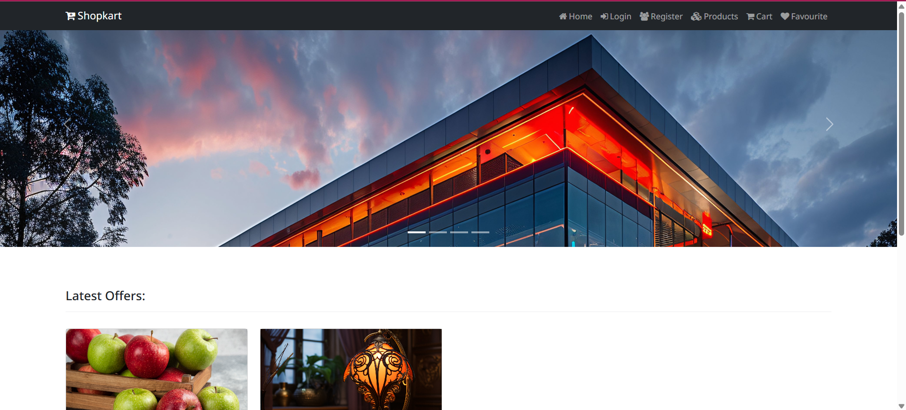
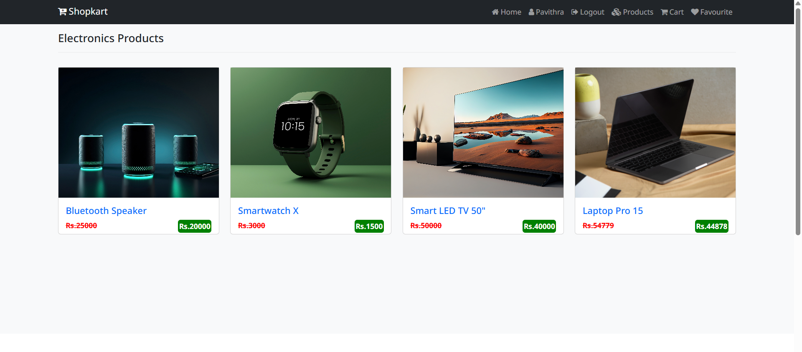
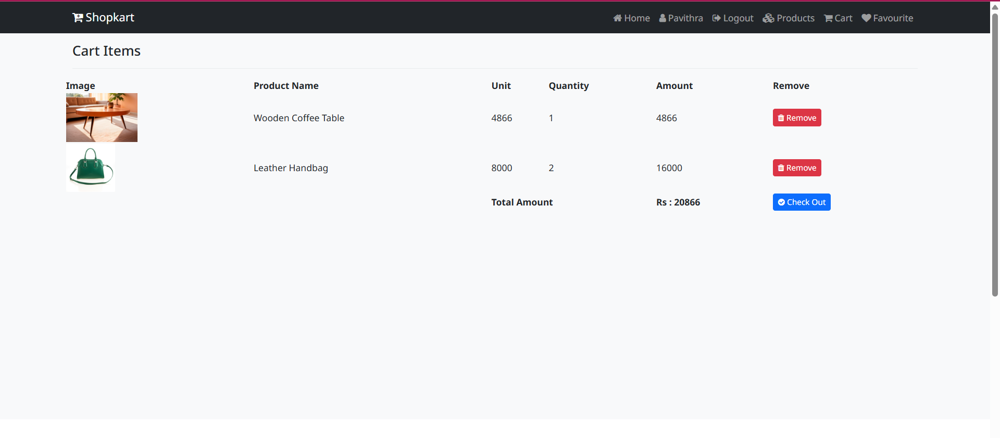

# ECOMMERCE PROJECT

#### Developed By : Pavithra

### Description:
A full-stack E-Commerce web application built using Python and Django. The project includes user authentication, product listings, shopping cart functionality, favorites/wishlist, and an admin dashboard for managing products and categories. Designed with responsive frontend templates and backend database integration to provide a seamless online shopping experience.

## Screenshots:

### Home Page:

### Product Page:

### Cart Page:

### Features:
* Register
* Login
* Add to Cart
* Add to Favourite
* Product Details
    
### Functions:
#### Cutomer / User:
* First Cutomer register their details with this product.
* Without login the user can view products and details.
* Then login their details with login page , once their logged in then view cart and favourite items.
* Customer can view product details but once their logged in then I'll authorize the user to view cart and favourite items.
* Customer can also add/remove product to cart (if customer try to add same product in cart. It will add only once and shows warning message).
    
### Feedback:
Any suggestion and feedback is welcome. You can message me on Linkedin [PavithraK](www.linkedin.com/in/pavithra-karuppannan)

